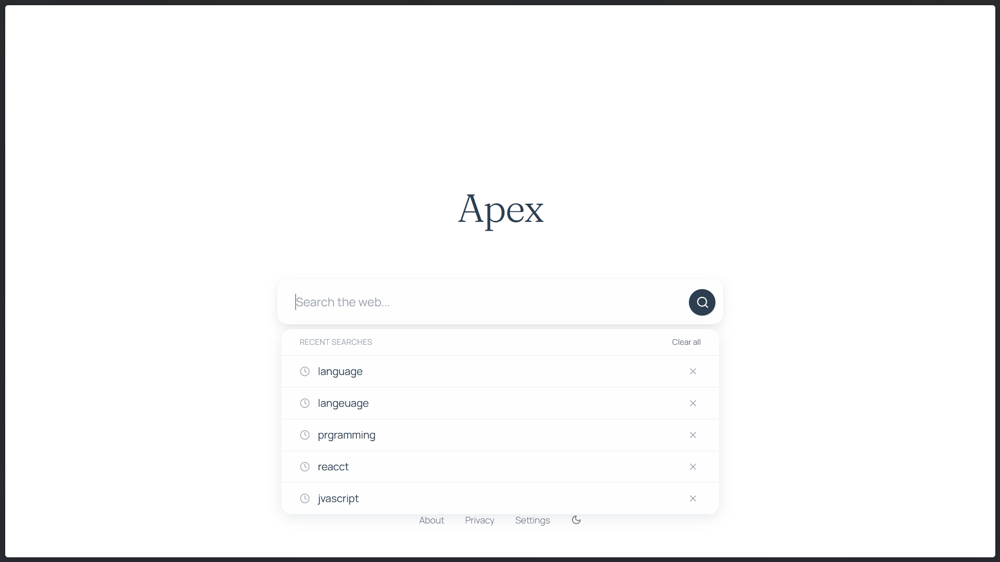
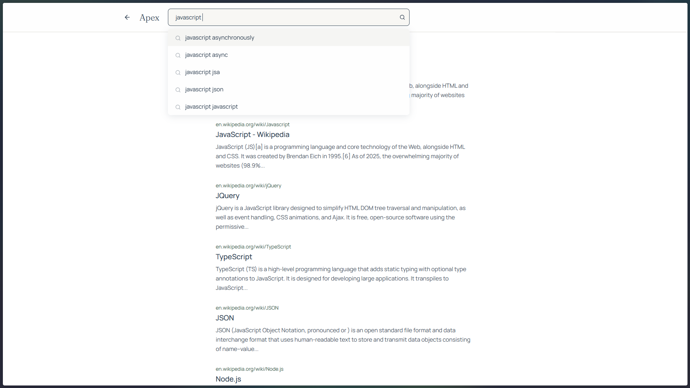
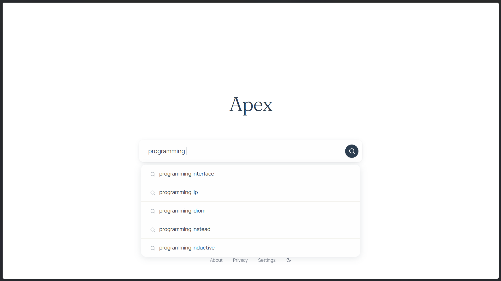
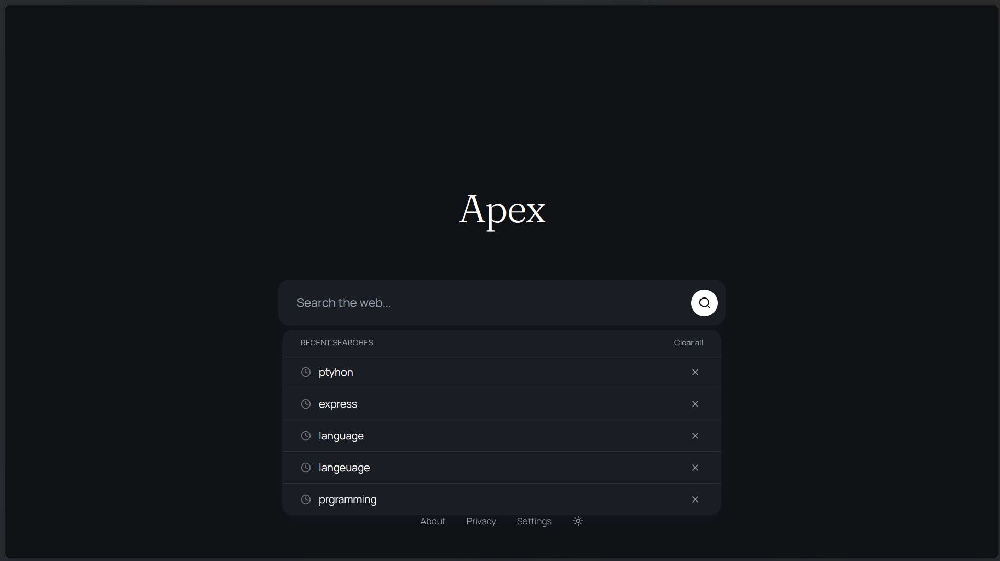
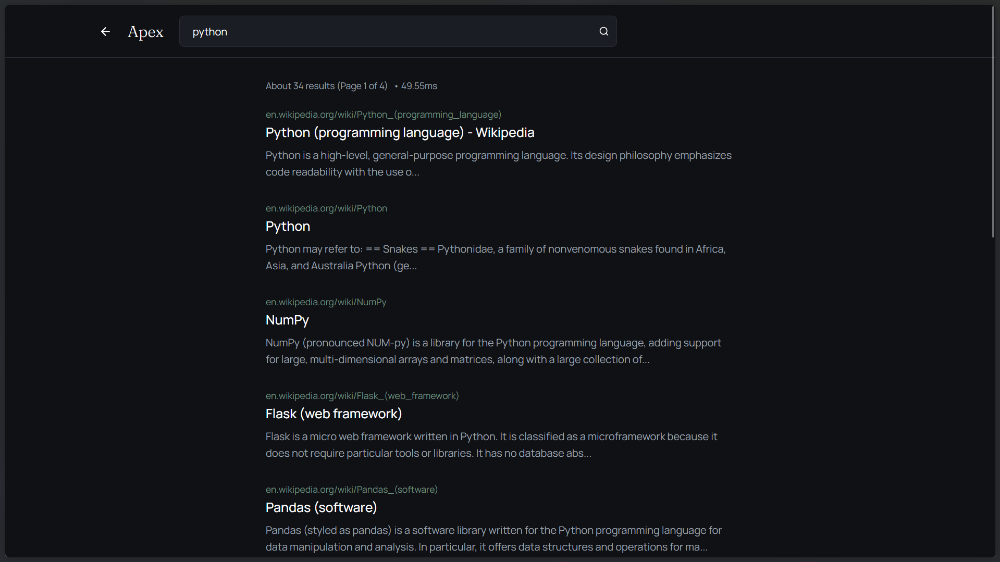
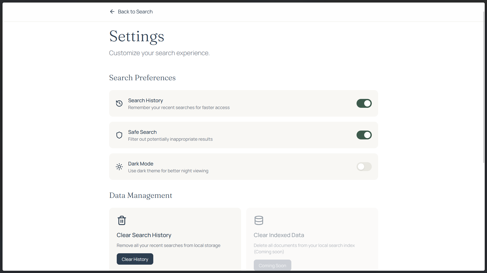
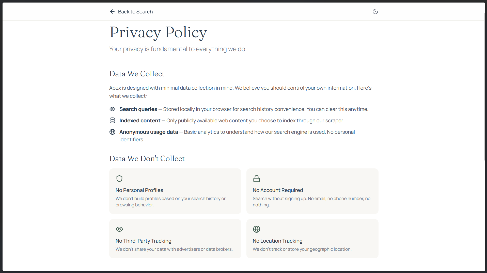
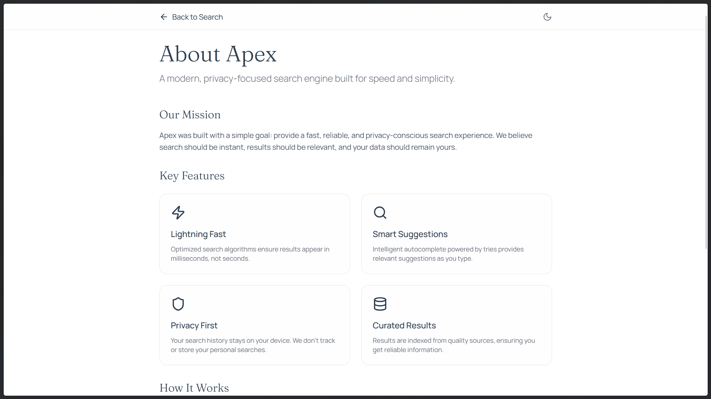

# Apex Search Engine

<p align="center">
  
</p>

A minimal, fast search engine built with modern web technologies. Apex uses advanced search algorithms including inverted indices, tries for autocomplete, and intelligent caching for optimal performance.

## Features

- ⚡ **Fast Search** - Optimized inverted index with binary search for lightning-fast queries
- 🔍 **Autocomplete** - Real-time search suggestions powered by Trie data structure
- 💾 **Smart Caching** - Redis-powered result caching for instant subsequent searches
- 🎯 **Fuzzy Matching** - Find results even with partial queries using Levenshtein distance
- 📱 **Responsive Design** - Beautiful, minimal UI that works on all devices
- 🔄 **URL Persistence** - Search results and queries persist in the URL for easy sharing
- 🌙 **Dark Mode** - Toggle between light and dark themes
- 📊 **Search History** - Track and revisit your recent searches
- 🛡️ **Safe Search** - Filter inappropriate content
- 🔐 **Security** - Built-in protection against NoSQL injection and XSS attacks
- 📤 **Data Export** - Export your search history and settings as JSON
- ⚡ **Performance Tracking** - View search response times
- 🔁 **Pagination** - Browse through large result sets
- ✨ **Query Corrections** - Get spelling suggestions for typos

## Tech Stack

### Frontend
- **React 18** - UI framework
- **TypeScript** - Type safety
- **Vite** - Build tool
- **Framer Motion** - Smooth animations
- **Tailwind CSS** - Styling
- **Axios** - HTTP client
- **Lucide React** - Icons
- **React Router v6** - Client-side routing
- **Radix UI** - 50+ accessible UI components
- **React Hook Form** - Form handling with Zod validation
- **Recharts** - Data visualization
- **next-themes** - Dark mode management
- **Sonner** - Toast notifications
- **cmdk** - Command palette
- **React Resizable Panels** - Flexible layouts

### Backend
- **Express.js 5** - Web framework
- **TypeScript** - Type safety
- **MongoDB** - Primary document storage
- **PostgreSQL** - Alternative database with Prisma ORM
- **Redis** - Search result caching
- **Prisma** - Type-safe database queries
- **Helmet** - Security headers
- **Custom Search Algorithms**:
  - Inverted Index with binary search
  - Trie (Prefix Tree) for autocomplete
  - MinHeap for ranking suggestions
  - Levenshtein distance for fuzzy matching

## Screenshots

### Search Results
<p align="center">
  
</p>

### History & Suggestions
<p align="center">
  
  
  
  
</p>

### Dark Mode
<p align="center">
  
  
</p>

### Settings & Privacy
<p align="center">
  
  
  
</p>

---

## Getting Started

### Prerequisites

- Node.js 18+
- MongoDB (local or Atlas) - Primary database
- PostgreSQL (optional, for Prisma)
- Redis (optional, for caching)

### Installation

1. Clone the repository:
```bash
git clone https://github.com/DevDad-Main/Apex.git
cd Apex
```

2. Install dependencies:
```bash
# Install client dependencies
cd client
npm install

# Install server dependencies
cd ../server
npm install
```

3. Configure environment variables:

**Server** (`.env` in server folder):
```env
MONGO_URI=your_mongodb_connection_string
REDIS_URL=your_redis_url
PORT=3000
```

**Client** (`.env` in client folder):
```env
VITE_API_URL=http://localhost:3000
```

4. Start the development servers:

```bash
# Terminal 1 - Start backend
cd server
npm run dev

# Terminal 2 - Start frontend
cd client
npm run dev
```

5. Open http://localhost:5173 in your browser

### Building for Production

```bash
# Build client
cd client
npm run build

# Build server
cd ../server
npm run build
```

## API Endpoints

| Method | Endpoint | Description |
|--------|----------|-------------|
| GET | `/apex/search?query=<query>&page=<page>` | Search for documents |
| GET | `/apex/autocomplete?q=<prefix>` | Get search suggestions |
| POST | `/apex/scrape` | Scrape and index a URL |
| GET | `/apex/document/:id` | Get a specific document |
| GET | `/apex/document` | Get all documents |
| DELETE | `/apex/document` | Delete all documents |
| GET | `/` | Health check endpoint |

### Example Requests

```bash
# Search for "javascript"
curl "http://localhost:3000/apex/search?query=javascript"

# Get autocomplete suggestions
curl "http://localhost:3000/apex/autocomplete?q=jav"

# Scrape a URL
curl -X POST "http://localhost:3000/apex/scrape" \
  -H "Content-Type: application/json" \
  -d '{"url": "https://example.com"}'
```

## Architecture

### Search Flow
1. User enters a search query
2. Frontend sends request to `/apex/search`
3. Backend checks Redis cache first
4. If not cached, searches inverted index using binary search
5. Results are cached and returned
6. Frontend displays results with animations
7. Response time is tracked and displayed

### Data Structures

- **Inverted Index**: Maps terms to documents for fast full-text search
- **Binary Search**: O(log n) lookup for prefix matching
- **Trie**: Prefix tree for O(m) autocomplete where m = query length
- **MinHeap**: Efficient ranking of autocomplete suggestions by relevance
- **Levenshtein Distance**: Calculate edit distance for fuzzy matching

### Security Features

- **Helmet.js**: Secure HTTP headers
- **NoSQL Injection Protection**: Custom middleware to sanitize user input
- **XSS Protection**: HTML entity escaping for user input
- **HPP Protection**: HTTP Parameter Pollution prevention
- **CORS**: Configurable cross-origin resource sharing
- **Input Validation**: Type-safe request handling

## Data Management

### Local Storage
- Search history stored in browser localStorage
- User preferences (dark mode, safe search, history toggle) persisted locally
- Data export functionality to download all user data as JSON

### Server Storage
- MongoDB for document storage and search indexing
- PostgreSQL with Prisma as alternative ORM option
- Redis for caching search results

## Contributing

1. Fork the repository
2. Create your feature branch (`git checkout -b feature/amazing-feature`)
3. Commit your changes (`git commit -m 'Add some amazing feature'`)
4. Push to the branch (`git push origin feature/amazing-feature`)
5. Open a Pull Request

## License

MIT

---

<p align="center">Built with ❤️ by <a href="https://github.com/DevDad-Main">DevDad</a></p>
